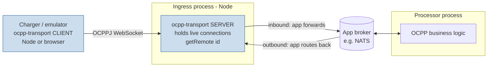

# ocpp-transport — Requirements

## Summary

A small, single-package OCPP-J (OCPP-over-WebSocket) transport library to replace `@push-rpc/core` for OCPP communication. It provides a typed client and server with a push-rpc-compatible API and wire format, but drops subscriptions, the extra transport adapters, and the multi-package "application framework" scope. It is OCPP-version-agnostic: it moves CALL/CALLRESULT/CALLERROR frames and knows nothing about OCPP actions, payloads, or versions.

---

## Problem Frame

`@push-rpc/core` is used today for all OCPP communication across multiple projects (notably the `bill` ingress/processor backend and the `charger` edge device). It works, but it carries three accumulating costs:

- **Bugs.** Real deployments have had to work around push-rpc behavior — e.g. an `adelay(11)` before concurrent calls and log-noise filters for spurious 1006 / "Prev session active" messages.
- **Scope too wide.** push-rpc is positioned as a general application framework: subscriptions, topics, throttling, filters, GET semantics, plus TCP/HTTP/OpenAPI adapters. None of this is used for OCPP, but all of it is entangled in the core session logic.
- **Over-complication.** The framework is spread across six NPM packages (`core`, `websocket`, `tcp`, `http`, `openapi`, `examples`), so even the OCPP-only use pulls in a multi-package surface.

Rather than continue improving push-rpc, the goal is a purpose-built transport that keeps only what OCPP communication needs. A useful accident discovered during research: push-rpc's generic JSON-array wire format (`[2,id,method,params]` / `[3,id,result]` / `[4,id,code,description,details]`) is already structurally identical to OCPPJ's CALL/CALLRESULT/CALLERROR frames, so wire compatibility is essentially free.

---

## Key Decisions

- **WS edge only.** The library owns the charger WebSocket connection — inbound dispatch and calling any connected charger by id. It does not own the cross-process hop between an OCPP ingress and an OCPP processor; the application keeps wiring that over its own broker (as `bill` does over NATS today). This is the single biggest scope boundary and the main source of "maximum simplicity."

- **push-rpc-compatible API and wire format.** Keep the typed proxy call model (`client.remote.Authorize(payload)`, `server.getRemote(id).RemoteStartTransaction(payload)`), the `local` handler-object model, lifecycle listeners, and `messageParser`. Compatibility is maintained for the surfaces real projects use, except where it conflicts with the simplicity/scope goals.

- **Generic, push-rpc-compatible error model.** Thrown handler errors serialize to CALLERROR via their `code`/`message`/extra properties; received CALLERRORs surface as rejected `Error`s carrying `code` and details. No dedicated `CallError` class and no validation of error codes against any OCPP version's enum — staying version-agnostic and maximizing compatibility, at the cost of OCPP-specific error ergonomics.

- **Keep-alive by idle timeout, not by protocol ping.** Liveness is an idle timeout on *any* inbound frame: the connection is declared dead and force-closed when nothing arrives within the configured window, and any inbound frame resets the timer. Because OCPP Heartbeat (and its replies) are the messages that flow during otherwise-idle periods, liveness rides on Heartbeat naturally — without the transport ever parsing or knowing about the Heartbeat action. An optional native WS ping/pong is available for Node peers that want faster, traffic-independent detection. push-rpc's emulated application-level PING message is dropped entirely.

- **Server Node-only; client Node and browser.** The server runs only under Node (`ws`). The client must also run in the browser to support a web-based OCPP charger emulator, so the client keeps a thin socket abstraction with two built-in factories (Node `ws` and browser `WebSocket`). A browser client cannot send native ping frames, so it relies on idle-timeout liveness plus whatever OCPP traffic the app sends.

- **Single package.** One NPM package with WebSocket support built in. No separate core/adapter packages.

- **Clean reimplementation, not a port.** Known push-rpc bugs (the ones that forced the `adelay(11)` workaround and the log-noise filters) are fixed in the new design rather than carried forward byte-for-byte.

---

## Architecture Context

Where the library sits relative to the deployment topology it must support. ocpp-transport owns only the shaded WebSocket edge; everything to the right of the ingress is the application's concern.

Simple single-process deployments (one Node process acting as both server and handler, or a standalone client) are the same library with no broker in the middle.

---

## Requirements

### Transport and protocol

- R1. Communicate over OCPPJ (OCPP-over-WebSocket) using the standard frame structure: CALL `[2, id, action, payload]`, CALLRESULT `[3, id, payload]`, CALLERROR `[4, id, errorCode, errorDescription, errorDetails]`.
- R2. Be OCPP-version-agnostic: treat actions as opaque strings and payloads as opaque JSON. The library has no knowledge of OCPP action names, payload schemas, error-code vocabularies, or version differences.
- R3. Handle WebSocket subprotocol negotiation (e.g. `ocpp1.6`, `ocpp2.0.1`): the offered subprotocols are presented to the upgrade hook (R9), which selects one in application-defined preference order or refuses the upgrade; the chosen subprotocol is echoed on the handshake and exposed on the connection context.

### Client

- R4. Provide a client created with a single factory call that connects out to a server URL, exposes a typed proxy (`remote`) for outbound OCPP calls, and accepts a `local` object of inbound handlers. The typed proxy is the sole public call surface — dynamic dispatch via computed property access (`remote[action](payload)`) is supported; any lower-level call primitive is internal, not part of the public API.
- R5. Run the client in both Node and the browser through a thin socket abstraction with built-in factories for Node `ws` and the browser `WebSocket` global.
- R6. Support configurable automatic reconnection after a connection drop (enable flag, reconnect delay/backoff).

### Server

- R7. Provide a server created with a single factory call that accepts incoming charger WebSocket connections, dispatches inbound OCPP calls to a typed `local` handler object, and maintains a registry of connected clients keyed by connection id.
- R8. Expose connection management: `getRemote(id)` returns a typed proxy for calling a connected charger, plus `isConnected(id)`, `getConnectedIds()`, `disconnectClient(id)`, and `close()`.
- R9. Provide a single app-owned upgrade hook that runs at the WebSocket handshake. It receives the HTTP upgrade request and either **rejects** the connection with an HTTP status code (e.g. 401/403/404/429) before the socket is established, or **accepts** it and returns the connection context — the connection identity (charger id) and the selected subprotocol. This hook is the application's authentication/authorization boundary: the library authenticates nothing itself, and identity derived from the request (URL path, headers, subprotocol) is trustworthy only because the hook validated the request. When a new connection presents an identity already held by an active connection, the library evicts the existing session only *after* the new connection has passed the hook's authentication — so an unauthenticated/unauthorized connection cannot force-disconnect a live charger (default policy: close the old session, post-auth). The resulting context is available to handlers and middleware, and the client surfaces an upgrade rejection (HTTP status) to the caller. Implementation note: this hook is realized by owning the raw HTTP `upgrade` event (`noServer`-style), not by composing `ws`'s built-in `verifyClient`/`handleProtocols` callbacks — those cannot deliver async auth + identity + subprotocol selection as one decision.
- R10. Run the server under Node only.

### Keep-alive and connection refresh

- R11. Provide idle-timeout liveness in both directions: declare a connection dead and force-close it when no inbound frame is received within a configurable `keepAliveTimeout`; reset the timer on any inbound frame. The transport never inspects message contents to do this.
- R12. Provide an optional native WS ping/pong probe (configurable interval) for Node peers that want faster, traffic-independent dead-connection detection. Off unless configured; unavailable for browser clients.
- R13. After a drop or a dead-connection force-close, a reconnect-enabled client re-establishes the connection automatically.

### Calls, timeouts, and errors

- R14. Support a default call timeout and a per-call timeout override; a call whose response does not arrive in time rejects. The timeout deadline starts when the application initiates the call, so it covers time spent queued behind serialized predecessors (R17) — not only time after the frame is sent.
- R15. Correlate responses to requests by message id; a response carrying an unknown or already-settled id is ignored rather than resolving an unrelated call. (Outbound calls are serialized per R17, so this matches the single in-flight outbound response and distinguishes it from inbound CALLs the peer interleaves.)
- R16. Error handling, push-rpc-compatible with three safety constraints:
  - **(a) Outbound allowlist.** Serialize a thrown handler error into a CALLERROR from an explicit allowlist of properties — `code`, `message`, and a named `details`/`data` field — never a blanket spread of all enumerable properties, which would leak internal diagnostics (stacks, query strings, secrets) to field devices.
  - **(b) Structurally-valid errorCode.** When a thrown error has no `code`, emit a fixed fallback `errorCode` string (e.g. `GenericError`) rather than null/undefined, so every CALLERROR frame is structurally valid. The error-code *vocabulary* is still not validated, preserving R2's version-agnosticism.
  - **(c) Inbound sanitization.** Surface a received CALLERROR as a rejected `Error` carrying `code` and details, sanitizing the incoming details before merge (drop `__proto__`/`constructor`/`prototype`, merge via a null-prototype object) to prevent prototype pollution from untrusted charger input.
  - **(d) Inbound action-name guard.** Resolve inbound handlers from a null-prototype handler map (or an explicit guard) so an untrusted action name matching an `Object.prototype` property (`constructor`, `__proto__`, `toString`, …) cannot resolve to a non-handler; reject such a frame with a CALLERROR.
  - No dedicated error class.
- R17. Outbound calls are always serialized per connection — each awaits its response before the next is sent. This is the only behavior, not a configurable mode: some real chargers (e.g. AE/ABL) cannot handle concurrent outbound CALLs, and serialized delivery matches what production relies on today. Consequence: a non-responding call holds the per-connection outbound queue (head-of-line blocking) until its call timeout (R14) fires, after which the queue drains — so the call timeout bounds worst-case queued-call latency.

### Middleware

- R18. Support local middleware (inbound-handler interception) on both client and server, preserving push-rpc's `Middleware` signature `(ctx, next, params, messageType)` and a `composeMiddleware` helper, so existing server middleware (rate limiting, metering, RPS measurement, null-to-empty-object normalization) ports with minimal change. Remote middleware (intercepting outbound calls, on either side) is deferred until a real consumer needs it — the signature stays compatible so it can be added without a breaking change.

### Extensibility and observability

- R19. Allow a pluggable `messageParser` and serialization, including date handling/reviver hooks, so applications can absorb vendor-specific malformed JSON and non-standard date formats seen from real chargers. The library enforces a configurable maximum WebSocket message size (with a documented safe default) at the raw-frame level *before* invoking any parser; custom parsers are not trusted to enforce size or nesting limits.
- R20. Emit connection-lifecycle and message events: `connected`, `disconnected`, `messageIn`, `messageOut` (with connection context on the server side). The `messageIn`/`messageOut` events carry the raw serialized frame; since OCPP payloads can contain credentials, ID tokens, or PII, redaction is the consumer's responsibility — the library does not redact, and this trust boundary is documented so loggers and event consumers handle sensitive payloads deliberately.
- R21. Allow an injectable logger so host applications can route and filter the library's logging. The logger receives whatever the events carry (R20), so the same redaction responsibility applies.

### Packaging and compatibility

- R22. Ship as a single NPM package with WebSocket support built in — no separate core/adapter packages.
- R23. Maintain API compatibility with `@push-rpc/core` for the surfaces real projects use, deviating only where compatibility conflicts with the simplicity/scope goals.
- R24. Do not include subscriptions, topics, GET, throttling, or filters in any form.

---

## Key Flows

- F1. Inbound OCPP call (charger → server)
  - **Trigger:** A connected charger sends a CALL (e.g. `Authorize`).
  - **Steps:** Server receives the frame → parses it via the configured parser → resolves the handler from the `local` object by action name → runs local middleware → invokes the handler with payload + connection context → serializes the return value as CALLRESULT (or the thrown error as CALLERROR).
  - **Covered by:** R1, R7, R16, R18, R19, R20.

- F2. Outbound OCPP call (server → specific charger)
  - **Trigger:** Application code calls `server.getRemote(chargerId).RemoteStartTransaction(payload)`.
  - **Steps:** Resolve the live connection by id → send CALL with a fresh message id → await CALLRESULT/CALLERROR correlated by id, subject to the call timeout.
  - **Covered by:** R8, R14, R15, R16. (Remote middleware for outbound calls is deferred per R18.)

- F3. Reconnect after drop (client)
  - **Trigger:** The client's socket closes unexpectedly while reconnect is enabled.
  - **Steps:** Emit `disconnected` → wait the reconnect delay/backoff → re-establish the socket → emit `connected`. In-flight calls fail per the timeout/error rules.
  - **Covered by:** R6, R13, R20.

- F4. Dead-connection detection
  - **Trigger:** No inbound frame arrives within `keepAliveTimeout` (or, on Node with the optional native ping enabled, a missed pong).
  - **Steps:** Declare the connection dead → force-close the socket → emit `disconnected` → on the client, F3 reconnects.
  - **Browser-client limitation:** A browser client cannot send native ping frames, so its liveness is detect-on-inbound-silence only — bounded only if the server sends periodic traffic. Without server-originated periodic frames, a browser client cannot detect a half-open dead server within `keepAliveTimeout`.
  - **Covered by:** R11, R12, R13.

---

## Acceptance Examples

- AE1. Call timeout
  - **Covers R14.**
  - **Given** a default call timeout and a charger that never replies to `RemoteStartTransaction`,
  - **When** the timeout elapses,
  - **Then** the outbound call rejects with a timeout error and the message id is dropped from the in-flight set.

- AE2. CALLERROR propagation
  - **Covers R16.**
  - **Given** a server handler that throws an error with `code = "NotSupported"` and extra detail fields,
  - **When** the charger calls that action,
  - **Then** the charger receives a CALLERROR `[4, id, "NotSupported", message, details]`, and on the calling side the promise rejects with an `Error` whose `code` is `"NotSupported"` and which carries the details.

- AE3. Idle-timeout dead detection rides on Heartbeat without parsing it
  - **Covers R11.**
  - **Given** `keepAliveTimeout` set above the charger's Heartbeat cadence,
  - **When** the charger keeps sending Heartbeats (or any frame),
  - **Then** the connection stays alive; **and when** all inbound traffic stops for longer than `keepAliveTimeout`, the connection is force-closed — with no transport-side inspection of the Heartbeat action.

- AE4. Malformed inbound JSON
  - **Covers R19.**
  - **Given** a custom `messageParser` that repairs a known vendor malformation,
  - **When** that vendor sends a non-standard frame,
  - **Then** the parser normalizes it and the call is dispatched normally; a frame the parser cannot handle surfaces as a parse error without tearing down unrelated connections.

- AE5. Response correlation by message id
  - **Covers R15.**
  - **Given** an outbound CALL awaiting its response,
  - **When** a CALLRESULT arrives carrying that message id (possibly interleaved with unrelated inbound traffic),
  - **Then** it resolves the matching pending call; a response bearing an unknown or already-settled id is ignored rather than resolving an unrelated call.

---

## Success Criteria

- Wire and API parity is verified against the real `bill` and `charger` call sites — the surfaces those projects use map onto ocpp-transport with no behavioral regressions.
- The transport-level 1006 / "Prev session active" log-noise filters can be removed once a consumer runs on ocpp-transport, with no regression — direct evidence the motivating transport bugs are actually fixed.
- The app-layer `adelay(11)` concurrency workaround is *attempted and verified* to be removable (it predates this library and may already be unnecessary against push-rpc; serialized outbound per R17 should make it unneeded) — a verification step, not the bug-fix proof itself.
- A consumer (charger or `bill` ingress) can be brought up on the library in a staging environment exercising inbound calls, outbound calls, reconnect, and dead-connection detection.

---

## Scope Boundaries

### Deferred for later

- Migrating `bill` and `charger` off `@push-rpc/core` onto ocpp-transport — separate, later work. This brief only builds the library.
- Any OCPP message/schema validation or action-typing helpers — if wanted, a separate companion concern layered above the transport, never inside it.

### Outside this product's identity

- Subscriptions, topics, pub/sub, throttling, filters, GET semantics (push-rpc framework features).
- TCP, HTTP, and OpenAPI transports/adapters.
- The cross-process backplane / broker between ingress and processor — the application owns this.
- Any OCPP-version-specific logic, including a validated error-code vocabulary.

---

## Dependencies / Assumptions

- Runtime: `ws` for the Node server and Node client; the browser `WebSocket` global for the browser client.
- The application owns the ingress↔processor transport (e.g. NATS) and forwards inbound calls / routes outbound calls itself.
- Applications tune `keepAliveTimeout` relative to the expected Heartbeat cadence; for tighter or traffic-independent detection on Node, they enable the optional native ping.
- Real chargers emit non-standard JSON and date formats; the parser/serializer hooks are load-bearing, not optional polish.

---

## Outstanding Questions

### Resolve before planning (from 2026-06-29 review)

- When push-rpc API compatibility (R23) conflicts with the maximum-simplicity north star, which wins? Proposed default: simplicity wins; compatibility is preserved only for surfaces a real consumer demonstrably uses — and those surfaces should be enumerated.
- Should the native WS ping default *on* for the Node client to preserve the dead-connection detection latency the `charger` currently gets from emulated PING, and how should `keepAliveTimeout` be re-tuned against Heartbeat cadence now that emulated PING is dropped?
- Does the library ship behind at least one committed migration target (`charger` or `bill` ingress) as its definition of done, or is migration genuinely deferred — accepting the risk of a third transport maintained alongside push-rpc?

### Deferred to planning

- Exact package name and module layout.
- TypeScript generics shape for the typed `remote` proxy and `local` handler objects.
- Default values and backoff policy for reconnect, call timeout, and `keepAliveTimeout`, and the default native-ping interval when enabled.
- Whether connection-lifecycle events are exposed as a listeners object (push-rpc style) or an emitter, and how connection id is keyed for the server registry.

---

## Sources / Research

External projects referenced for API shape and real-world usage (paths relative to each project root):

- `bill`: `pkg/server/pkg/ocpp-ingress-server/ws/ocppWebsocket.ts` (server creation, timeouts, custom parser, middleware), `pkg/server/pkg/ocpp-ingress-server/ingress.ts` (forwarding inbound to the broker), `pkg/server/chargePointConnections.ts` and `startCharging.ts` (outbound calls back to chargers, the `adelay(11)` workaround).
- `charger`: `pkg/evse/station/ocppServerClient.ts` (client reconnect/ping config, listeners), `pkg/evse/station/ChargePointImpl.ts` (inbound handler implementations).
- `push-rpc`: `packages/core/src/client.ts`, `server.ts`, `RpcSession.ts`, `transport.ts`, `rpc.ts`, `utils.ts` (the API surface, middleware signature, ping/keep-alive, call correlation/timeout, and error serialization being selectively preserved).
