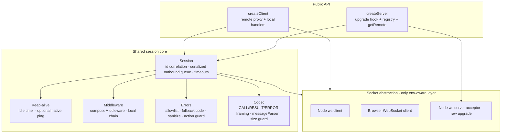

# feat: ocpp-transport — OCPP-J WebSocket transport library

## Summary

Build `ocpp-transport`: a single-package, OCPP-version-agnostic OCPP-J (OCPP-over-WebSocket) transport library — typed client and server, push-rpc-compatible API and wire format — to replace `@push-rpc/core` for OCPP communication. This plan builds the library only; migrating `bill`/`charger` is deferred (see origin).

---

## Problem Frame

`@push-rpc/core` carries OCPP communication today but is over-scoped (subscriptions/topics/adapters), spread across six packages, and has accreted bug workarounds. The goal is a purpose-built transport that keeps only what OCPP needs (see origin: `docs/brainstorms/2026-06-29-ocpp-transport-requirements.md` Problem Frame). push-rpc's JSON-array wire format is already structurally identical to OCPPJ frames, so the work is selective reimplementation of push-rpc's transport core — not a greenfield protocol.

---

## Key Technical Decisions

- KTD1. **Single TypeScript package, `ws` bundled.** One npm package exporting `createClient` / `createServer` and shared types; `ws` is a direct dependency for the Node paths; the browser client uses the `WebSocket` global. No core/adapter split. (R22)

- KTD2. **Compatibility tiebreaker — simplicity wins (resolves origin Outstanding Q1).** API compatibility with `@push-rpc/core` is preserved only for the surfaces real consumers use: `createClient`/`createServer` factories, the `remote` typed proxy + `getRemote(id)`, the `local` handler-object model, `composeMiddleware` + the `Middleware` signature `(ctx, next, params, messageType)`, the pluggable `messageParser`, lifecycle listeners, and the injectable logger. Deliberately dropped: topics/GET/subscribe message types, the emulated application-level PING, the `syncRemoteCalls` configuration knob (serialization is now unconditional, KTD5), and any dedicated error class. (R23, R24)

- KTD3. **Native ping defaults on for the Node client, off for the server (resolves origin Outstanding Q2).** The Node client enables native `ws` ping/pong by default to preserve the ~40s dead-connection detection latency `charger` gets today from emulated PING; the server defaults to idle-timeout-only liveness (matching `bill`'s `pingSendTimeout: null`), since it relies on inbound charger traffic. Both are configurable. `keepAliveTimeout` defaults are documented relative to typical Heartbeat cadence. (R11, R12)

- KTD4. **Server owns the raw HTTP `upgrade` event (`noServer`-style).** A single app-supplied upgrade hook performs auth/reject (with HTTP status), identity derivation, and subprotocol selection as one async decision. It is not built by composing `ws`'s `verifyClient` + `handleProtocols`, which cannot deliver async-auth + identity + subprotocol together. (R3, R9)

- KTD5. **Outbound calls are always serialized per connection; timeout starts at call initiation.** No `syncRemoteCalls` flag — serialization is the only behavior (AE/ABL chargers require it and production already relies on it). The call-timeout clock starts when the app initiates the call, so it bounds queue-wait and head-of-line-blocking latency. (R14, R15, R17)

- KTD6. **Thin socket abstraction for cross-environment client.** A minimal `Socket` interface with built-in factories (Node `ws` client, browser `WebSocket` client) and a Node `ws` server acceptor. This is the only place environment branches; everything above it (session, codec, middleware) is environment-agnostic. (R5, R10)

- KTD7. **Generic error model with safety rails, no error class.** Errors serialize to/from CALLERROR via push-rpc-compatible code/message/details, but with an outbound property allowlist, a fallback `errorCode`, inbound details sanitization, and a prototype-safe action-name lookup. No OCPP error-code vocabulary validation (stays version-agnostic). (R16)

Migration of `bill`/`charger` remains deferred (origin Outstanding Q3): the plan builds the library and a parity-verification harness rather than a migration unit.

---

## High-Level Technical Design

Layered architecture — the socket abstraction is the only environment-aware layer; the session core is shared by both the client and server factories.



Inbound vs outbound message handling within a session:

```mermaid
sequenceDiagram
  participant Peer
  participant Codec
  participant Session
  participant MW as Local middleware
  participant H as Handler
  Note over Peer,H: Inbound CALL (F1)
  Peer->>Codec: frame (size-guarded, parsed)
  Codec->>Session: [2, id, action, payload]
  Session->>Session: action-name guard (null-proto lookup)
  Session->>MW: ctx, next, payload
  MW->>H: invoke
  H-->>Session: result / throw
  Session->>Peer: CALLRESULT [3,id,result] or CALLERROR [4,id,code,desc,details]
  Note over Peer,Session: Outbound CALL (F2) — serialized
  Session->>Session: enqueue; await prior in-flight
  Session->>Peer: CALL [2,id,action,payload]
  Peer-->>Session: CALLRESULT/CALLERROR (matched by id)
```

---

## Output Structure

Greenfield layout. Per-unit `**Files:**` are authoritative; this tree is the scope declaration.

```text
ocpp-transport/
├── package.json
├── tsconfig.json
├── src/
│   ├── index.ts            # public exports
│   ├── types.ts            # Socket, Middleware, options, context types
│   ├── codec.ts            # framing, messageParser, serializer, size guard
│   ├── errors.ts           # serialize/sanitize, fallback code, action-name guard
│   ├── middleware.ts       # composeMiddleware + Middleware type
│   ├── session.ts          # correlation, serialized queue, timeouts
│   ├── keepAlive.ts        # idle-timeout + optional native ping
│   ├── client.ts           # createClient, remote proxy, reconnect
│   ├── server.ts           # createServer, upgrade hook, registry
│   ├── logger.ts           # injectable logger
│   └── socket/
│       ├── nodeClient.ts       # Node ws client factory
│       ├── browserClient.ts    # browser WebSocket client factory
│       └── nodeServer.ts       # raw-upgrade ws server acceptor
├── test/                   # *.test.ts (co-located or here)
└── examples/
    ├── simple-server.ts
    ├── simple-client.ts
    └── PARITY.md           # mapping vs bill/charger call sites
```

---

## Requirements Traceability

Requirements R1–R24 from the origin map to units as follows (each unit restates its own in `**Requirements:**`): framing/codec R1, R2, R19 → U2; sockets R5, R10 → U3; session/calls R14, R15, R17 → U4; errors R16 → U5; middleware R18 → U6; keep-alive R11, R12, R20 → U7; client R4, R6, R13 → U8; server R3, R7, R8, R9 → U9; observability R20, R21 → U10; packaging R22 → U1; compat R23, R24 → U11. Acceptance Examples AE1–AE5 attach to U2/U4/U5/U7 test scenarios.

---

## Implementation Units

Grouped into four phases. Dependencies cite U-IDs.

### Phase A — Foundations

### U1. Package scaffold and build setup

- **Goal:** Stand up the single-package TypeScript project with build, type emission, exports, and a test runner.
- **Requirements:** R22.
- **Dependencies:** none.
- **Files:** `package.json`, `tsconfig.json`, `src/index.ts` (initial exports), test-runner config.
- **Approach:** Single package; `ws` as a dependency, `@types/ws` dev. Dual ESM/CJS or ESM-only per ecosystem norm; emit `.d.ts`. `exports` map points to built output. Browser entry must not statically import `ws` (KTD6) — keep `ws` imports isolated to `src/socket/nodeClient.ts` / `src/socket/nodeServer.ts` so bundlers can tree-shake them out of browser builds.
- **Patterns to follow:** push-rpc's package layout, minus the multi-package split (origin: `push-rpc` `packages/core`).
- **Test scenarios:** Test expectation: none — scaffolding. Verify `build` produces types and the package imports cleanly in a Node smoke check.
- **Verification:** `build` succeeds, emits types; a trivial `import { createClient, createServer } from "ocpp-transport"` resolves.

### U2. Frame codec, pluggable parser, and size guard

- **Goal:** Encode/decode CALL/CALLRESULT/CALLERROR frames; support a pluggable `messageParser`/serializer with date-reviver hooks; enforce a max raw-frame size before parsing.
- **Requirements:** R1, R2, R19.
- **Dependencies:** U1.
- **Files:** `src/codec.ts`, `src/types.ts`, `test/codec.test.ts`.
- **Approach:** Treat action as opaque string, payload as opaque JSON. Default parser is `JSON.parse` with an injectable override and a date reviver; serializer mirrors. The serializer must **not mutate the caller's payload** — push-rpc's `convertDateToString` rewrites `Date` fields to strings in place on the original object, corrupting caller state on reuse (a likely root of the `adelay` workarounds); operate on a copy or stringify without in-place conversion. Enforce a configurable max message size on the raw frame *before* invoking the parser (default **64 KiB** — ample for any realistic OCPP payload; the configurable hard ceiling is deferred per Scope Boundaries); a frame exceeding it or unparseable surfaces as a parse error scoped to that frame, never tearing down the connection.
- **Patterns to follow:** push-rpc `packages/core/src/utils.ts` (`message`, date handling); `bill`'s `brokenJsonParser` as the canonical custom-parser use case.
- **Test scenarios:**
  - Encodes a CALL `[2,id,action,payload]` and round-trips decode.
  - Decodes CALLRESULT `[3,id,result]` and CALLERROR `[4,id,code,desc,details]`.
  - Covers AE4. A custom `messageParser` repairs a known malformed vendor frame and the result decodes; an unrepairable frame surfaces a parse error without affecting other frames/connections.
  - A frame larger than the configured max is rejected before the parser runs; the parser is not invoked.
  - Date-reviver hook converts an ISO-8601 string field to a `Date` on decode.
  - Encoding an outbound payload that contains `Date` fields leaves the caller's original object unchanged (no in-place mutation).
- **Verification:** Codec round-trips all three frame types; size guard and parser-override paths covered.

### U3. Socket abstraction and factories

- **Goal:** Define the minimal `Socket` interface and the three built-in implementations (Node `ws` client, browser `WebSocket` client, Node `ws` server acceptor).
- **Requirements:** R5, R10.
- **Dependencies:** U1.
- **Files:** `src/socket/nodeClient.ts`, `src/socket/browserClient.ts`, `src/socket/nodeServer.ts`, `src/types.ts` (Socket interface), `test/socket.test.ts`.
- **Approach:** `Socket` exposes open/message/close/error hooks, `send`, an upgrade-failure hook carrying the HTTP status (e.g. `onUnexpectedResponse(status, message)` — the Node client wires `ws`'s `unexpected-response` event, which `ws` fires *separately* from `error`; the browser `WebSocket` global cannot expose the status, so its path degrades to a generic connection error), and (Node only) native `ping`/`pong`. The browser factory implements the same interface over the `WebSocket` global with native ping unavailable. The Node server acceptor owns the raw HTTP `upgrade` wiring; **the hook's TypeScript signature is defined here in `types.ts`** and U9 supplies the auth/identity/subprotocol decision into it (the acceptor produces a `Socket` only after the hook accepts). Keep all `ws` imports confined to the Node files.
- **Patterns to follow:** push-rpc `packages/core/src/transport.ts` (Socket interface), `packages/websocket/src/server.ts` (ws wrapping) — drop the DOM emulated-ping path.
- **Test scenarios:**
  - Node client socket connects to a local ws server, exchanges a message, and reports close.
  - Browser-shaped socket (via a `WebSocket` test double) satisfies the same interface and surfaces messages; native ping is absent/no-op.
  - Server acceptor emits a `Socket` per accepted upgrade and routes inbound frames to it.
  - An upgrade the hook rejects (U9) never yields a `Socket`.
- **Verification:** All three factories satisfy the `Socket` contract under their respective environments (browser via test double).

### Phase B — Session and semantics

### U4. Session core — correlation, serialized outbound queue, timeouts

- **Goal:** Per-connection session managing message-id correlation, unconditional serialized outbound dispatch, and call timeouts measured from initiation.
- **Requirements:** R14, R15, R17.
- **Dependencies:** U2, U3.
- **Files:** `src/session.ts`, `test/session.test.ts`.
- **Approach:** Maintain pending-by-id and a per-connection outbound queue; only one outbound CALL in flight at a time (KTD5). Record an initiation timestamp at *enqueue* time. The timeout sweep evaluates **both the in-flight call and every queued call** against that timestamp — a call can time out and reject while still queued (never sent). This is the explicit fix for push-rpc's `timeoutCalls`, which scans only in-flight calls (`runningCalls`) and sets `startedAt` at send time, leaving queued calls to pile up unboundedly behind a stalled call. Inbound responses are matched by id; unknown/already-settled ids are ignored. No `syncRemoteCalls` flag.
- **Patterns to follow:** push-rpc `packages/core/src/RpcSession.ts` (`queue`, `runningCalls`, `flushPendingCalls`, `timeoutCalls`) — but make serialization unconditional and start the timeout clock at enqueue, fixing the reference impl's send-time timer.
- **Test scenarios:**
  - Covers AE1. With a default timeout and a peer that never replies, the outbound call rejects with a timeout error and the id is removed from the in-flight set.
  - Covers AE5. A CALLRESULT with a pending id resolves the matching call; a response with an unknown or already-settled id is ignored.
  - Two outbound calls A then B: B is not sent until A settles (serialization); B's timeout accounts for time queued behind A (initiation-time clock).
  - A call that times out while still queued (its predecessor never settled and B was never sent) rejects with a timeout error and is removed from the queue — distinct from the in-flight-timeout case.
  - Head-of-line: a stalled in-flight call holds the queue until its timeout fires, after which the queue drains.
- **Verification:** Correlation, serialization, and initiation-time timeout all covered; no concurrent in-flight outbound observable.

### U5. Error model — serialize, sanitize, guard

- **Goal:** Push-rpc-compatible error handling with the four safety rails.
- **Requirements:** R16.
- **Dependencies:** U2, U4.
- **Files:** `src/errors.ts`, `test/errors.test.ts`.
- **Approach:** Outbound: serialize a thrown handler error into CALLERROR from an explicit allowlist (`code`, `message`, named `details`/`data`) — never a blanket property spread; when `code` is absent emit a fixed fallback `errorCode` (e.g. `GenericError`). Inbound: surface a received CALLERROR as a rejected `Error` carrying `code` + details, sanitizing details (drop `__proto__`/`constructor`/`prototype`, merge via null-prototype object). Action-name guard: resolve handlers from a null-prototype map so a prototype-property action name can't resolve to a non-handler — reject with a CALLERROR.
- **Patterns to follow:** push-rpc `packages/core/src/RpcSession.ts` (`sendError`, error receive path) — add the allowlist, fallback, sanitization, and action guard the reference impl lacks.
- **Test scenarios:**
  - Covers AE2. Handler throws `{code:"NotSupported", ...details}`: peer receives `[4,id,"NotSupported",message,details]`; caller-side rejects with an `Error` whose `code` is `"NotSupported"` carrying details.
  - A thrown error with no `code` serializes with the fallback `errorCode`, never null/undefined.
  - A thrown error with extra non-allowlisted properties (stack, internal fields) does NOT leak them onto the wire frame.
  - A received CALLERROR whose details contain `__proto__`/`constructor` does not pollute `Object.prototype`.
  - An inbound CALL with `action = "constructor"` (or `__proto__`) is rejected with a CALLERROR and never invokes a non-handler.
- **Verification:** All four rails covered; prototype-pollution and info-disclosure negative tests pass.

### U6. Middleware

- **Goal:** Local middleware (inbound-handler interception) on client and server, with `composeMiddleware` and the push-rpc `Middleware` signature.
- **Requirements:** R18.
- **Dependencies:** U4.
- **Files:** `src/middleware.ts`, `test/middleware.test.ts`.
- **Approach:** `Middleware` is `(ctx, next, params, messageType) => Promise<any>`; `composeMiddleware` chains with single-`next` enforcement. Local middleware wraps inbound handler dispatch on both client and server. Remote middleware (outbound interception) is intentionally not wired (KTD2) but the signature stays compatible so it can be added later without a breaking change.
- **Patterns to follow:** push-rpc `packages/core/src/utils.ts` `composeMiddleware`; `bill`'s server-local middleware stack (`measureRps`, `meterRequest`, `nullToEmptyObject`).
- **Test scenarios:**
  - A composed chain runs middleware in order and reaches the handler with transformed params.
  - Calling `next()` twice in one middleware throws.
  - A middleware that short-circuits (returns without calling `next`) prevents handler invocation.
  - `messageType` is passed through to each middleware.
- **Verification:** Local middleware intercepts inbound dispatch on both roles; compose semantics match push-rpc.

### U7. Keep-alive and connection refresh

- **Goal:** Idle-timeout liveness both directions, optional native ping (Node), force-close on death, and lifecycle/message events.
- **Requirements:** R11, R12, R20.
- **Dependencies:** U3, U4.
- **Files:** `src/keepAlive.ts`, `src/session.ts` (wiring), `test/keepAlive.test.ts`.
- **Approach:** Idle timer resets on any inbound frame; on `keepAliveTimeout` with no inbound frame, declare dead and force-close (no content inspection). Optional native `ws` ping/pong probe on Node (default on for client per KTD3, off for server); a missed pong also triggers force-close. Native ping/pong frames are emitted directly on the socket and are **not** routed through the U4 serialized outbound CALL queue — they are transport-level frames independent of call correlation/timeout, so liveness probing cannot be head-of-line-blocked by an in-flight application call (push-rpc routed its emulated PING through the call queue; do not copy that). Emit `connected`/`disconnected`/`messageIn`/`messageOut`. Reconnect itself lives in U8 (client); this unit raises the close that triggers it.
- **Patterns to follow:** push-rpc `packages/core/src/RpcSession.ts` `checkKeepAlive` / ping handling — drop emulated PING; use native frames on Node.
- **Test scenarios:**
  - Covers AE3, F4. With `keepAliveTimeout` above Heartbeat cadence, continued inbound frames keep the connection alive; a silence longer than the timeout force-closes the socket and emits `disconnected` — with no inspection of frame contents.
  - Any inbound frame (not only a ping) resets the idle timer.
  - Node native ping enabled: a peer that stops responding to pings is force-closed before the idle timeout.
  - `messageIn`/`messageOut`/`connected`/`disconnected` fire with the expected payloads and (server-side) connection context.
- **Verification:** Dead connections force-close on both idle-timeout and missed-pong paths; events fire.

### Phase C — Public API

### U8. Client factory and reconnect

- **Goal:** `createClient` — connect to a server URL, typed `remote` proxy (dynamic dispatch), `local` handlers, auto-reconnect with backoff, and surfacing upgrade-rejection HTTP status.
- **Requirements:** R4, R6, R13.
- **Dependencies:** U4, U5, U6, U7.
- **Files:** `src/client.ts`, `test/client.test.ts`.
- **Approach:** `remote` is a Proxy turning property access into a serialized outbound CALL (`remote.Authorize(payload)` and `remote[action](payload)`); the explicit call primitive stays internal (KTD2). `local` is the inbound handler object. Reconnect loop re-establishes after drop/force-close with configurable delay/backoff; on connect/disconnect emit events. Surface an upgrade rejection's HTTP status to the caller (via the `ws` `unexpected-response` path).
- **Patterns to follow:** push-rpc `packages/core/src/client.ts` (`createRpcClient`, `connectionLoop`); `charger` `pkg/evse/station/ocppServerClient.ts` (reconnect/ping config, listeners) — minus resubscribe.
- **Test scenarios:**
  - `remote.SomeAction(payload)` and `remote["SomeAction"](payload)` both send a CALL and resolve on CALLRESULT.
  - An inbound CALL is dispatched to the matching `local` handler.
  - Covers part of F3. After an unexpected socket close with reconnect enabled, the client re-establishes after the backoff delay and emits `connected`; in-flight calls fail per timeout rules.
  - A rejected upgrade surfaces its HTTP status to the caller rather than hanging.
  - Native ping default-on for the Node client (KTD3) is observable in config.
- **Verification:** Round-trip outbound + inbound on a real local server; reconnect and rejection-status paths covered.

### U9. Server factory, upgrade hook, and registry

- **Goal:** `createServer` — accept connections via the app-owned upgrade hook, maintain a registry keyed by connection id, expose connection management, and dispatch inbound calls.
- **Requirements:** R3, R7, R8, R9.
- **Dependencies:** U3, U4, U5, U6, U7.
- **Files:** `src/server.ts`, `test/server.test.ts`.
- **Approach:** Own the raw HTTP `upgrade` event (KTD4). The single async hook `(req) => reject(status) | {context, subprotocol}` performs auth, identity derivation, and subprotocol selection; on accept, register the connection by id and echo the subprotocol. Expose `getRemote(id)` (typed proxy → serialized outbound CALL), `isConnected`, `getConnectedIds`, `disconnectClient`, `close`. Duplicate-identity: evict an existing session only *after* the new connection passes the hook (default close-old, post-auth). Critical: the old socket's close handler fires *after* the new session is installed in the registry, so the close handler must remove the registry entry only if it still points to the closing session (identity guard) — otherwise evicting the old connection silently deletes the freshly-authenticated new one (push-rpc guards this with `if (sessions[remoteId] == session)`).
- **Patterns to follow:** push-rpc `packages/core/src/server.ts` (`createRpcServer`, `getRemote`, registry); `bill` `pkg/server/pkg/ocpp-ingress-server/ws/ocppWebsocket.ts` (`verifyClient`/`handleProtocols`/`createConnectionContext` — to be unified into one hook).
- **Test scenarios:**
  - Covers F1. An inbound CALL from a connected client is dispatched through local middleware to the `local` handler; the return serializes as CALLRESULT.
  - Covers F2. `getRemote(id).SomeAction(payload)` sends a CALL to that connection and resolves on its response.
  - The upgrade hook rejecting returns the chosen HTTP status (e.g. 403/404/429) and no `Socket`/registry entry is created.
  - The hook selects a subprotocol in preference order and refuses when none match; the chosen subprotocol is echoed and exposed on context.
  - Duplicate identity: a new connection with an id already held evicts the old one only after passing the hook; an unauthenticated/unauthorized duplicate does NOT evict the live session.
  - After a duplicate eviction, the old socket closing does NOT remove the new connection's registry entry — `getConnectedIds` still contains the id and `getRemote(id)` still works (close-handler identity guard).
  - `isConnected`/`getConnectedIds`/`disconnectClient`/`close` reflect registry state.
- **Verification:** Auth/reject, identity, subprotocol, registry, getRemote, and post-auth eviction all covered.

### Phase D — Observability and verification

### U10. Logger injection and observability contract

- **Goal:** Injectable logger and the documented event payload/redaction contract.
- **Requirements:** R20, R21.
- **Dependencies:** U7, U8, U9.
- **Files:** `src/logger.ts`, `src/index.ts` (export), `test/logger.test.ts`.
- **Approach:** Allow a global or per-instance logger injection (push-rpc `setLogger`-compatible). `messageIn`/`messageOut` carry the raw serialized frame; the library does not redact — document that redaction is the consumer's responsibility (frames may carry credentials/PII). Ensure the same applies to whatever the logger receives.
- **Patterns to follow:** push-rpc `setPushRpcLogger` usage in `bill` (`pkg/server/pkg/ocpp-ingress-server/server.ts`).
- **Test scenarios:**
  - An injected logger receives the library's log calls.
  - `messageIn`/`messageOut` events carry the raw frame and (server-side) connection context.
  - Test expectation note: redaction is intentionally not performed by the library; assert raw-frame delivery, and that the contract is documented (see U11 docs).
- **Verification:** Logger injection works; event payload shape is asserted; redaction-responsibility documented.

### U11. Examples, parity harness, and docs

- **Goal:** Runnable example client/server, a documented parity mapping against `bill`/`charger` call sites, and the README covering API, the app-owned auth boundary, redaction responsibility, and keep-alive tuning.
- **Requirements:** R23, R24 (verify the compatibility surfaces are correct and that the excluded features are absent); supports the origin Success Criteria.
- **Dependencies:** U8, U9, U10.
- **Files:** `examples/simple-server.ts`, `examples/simple-client.ts`, `examples/PARITY.md`, `README.md`.
- **Approach:** Examples demonstrate a minimal server (upgrade hook + handlers + `getRemote`) and a minimal client (`remote` + handlers + reconnect). `PARITY.md` maps each push-rpc surface `bill`/`charger` use to its ocpp-transport equivalent (the KTD2 enumerated set), flagging deliberate drops, so the eventual migration is mechanical. README documents the auth-boundary and redaction trust boundaries and `keepAliveTimeout`/native-ping tuning guidance.
- **Patterns to follow:** the origin Sources/Research call-site inventory.
- **Test scenarios:**
  - The two examples run against each other end-to-end (inbound call, outbound `getRemote` call, reconnect, dead-connection detection) as an integration smoke test.
  - Test expectation: `PARITY.md`/README are docs — no unit test; covered by the example integration run.
- **Verification:** Examples exercise inbound + outbound + reconnect + dead-detection together; parity doc enumerates every KTD2 surface.

---

## Scope Boundaries

### Deferred for later (from origin)

- Migrating `bill` and `charger` off `@push-rpc/core` — separate, later work; this plan ships the library plus the U11 parity harness as the bridge.
- OCPP message/schema validation or action-typing helpers — a separate companion layer above the transport.

### Outside this product's identity (from origin)

- Subscriptions, topics, pub/sub, throttling, filters, GET semantics.
- TCP, HTTP, and OpenAPI transports/adapters.
- The cross-process backplane / broker between ingress and processor.
- Any OCPP-version-specific logic, including a validated error-code vocabulary.

### Deferred to follow-up work (plan-local)

- Remote (outbound) middleware wiring — signature kept compatible (U6), wired when a consumer needs it.
- A configurable hard ceiling/floor on the max-frame-size setting (origin round-2 FYI) — the default guard ships in U2; bounding misconfiguration is a follow-up.
- Connection-level rate limiting / connection-flood protection (origin residual) — belongs above the transport or in the upgrade hook; not built here.

---

## Risks & Dependencies

- **Reference-impl bug reproduction.** The plan adapts push-rpc's session logic; the `adelay(11)` and 1006/"Prev session active" issues must not be carried in. Mitigation: U4 starts the timeout clock at initiation and makes serialization unconditional; U9 owns the upgrade/eviction path cleanly; U11 verifies the log-noise filters are removable. Root-causing those symptoms in push-rpc was explicitly skipped during review — treat their non-recurrence as something to confirm during U4/U9, not assume.
- **Browser build hygiene.** `ws` must never reach the browser bundle (KTD6/U1). Risk: an accidental top-level `ws` import breaks browser consumers. Mitigation: confine `ws` to `src/socket/node*.ts` and add a browser-entry smoke check.
- **`ws` raw-upgrade ownership.** Owning the `upgrade` event (KTD4) bypasses `ws`'s built-in `verifyClient`/`handleProtocols`; subtle handshake details (subprotocol echo header, error status writes) must be handled manually. Mitigation: U3/U9 mirror `bill`'s `noServer: true` setup, which already does this.
- **Dependency:** `ws` (Node), `WebSocket` global (browser). No other runtime deps.

---

## Open Questions (deferred to implementation)

- Exact default values: `keepAliveTimeout`, native-ping interval, reconnect backoff curve, call timeout, max-frame size. Pick defaults during U2/U4/U7/U8 informed by `bill`/`charger` current config (30s call timeout, 20s ping, 40s keepalive).
- Module boundary between `session.ts` and `keepAlive.ts` — may merge if the split adds no clarity once implemented.
- ESM-only vs dual ESM/CJS publish target — settle in U1 against consumer needs.
- TypeScript generics shape for the typed `remote` proxy and `local` handler objects — refine during U8/U9.

---

## Sources / Research

- Origin requirements: `docs/brainstorms/2026-06-29-ocpp-transport-requirements.md` (two review rounds applied).
- Reference implementation — `push-rpc`: `packages/core/src/client.ts`, `server.ts`, `RpcSession.ts`, `transport.ts`, `utils.ts` (API surface, correlation/timeout, middleware, ping/keep-alive, error serialization to selectively reimplement).
- Consumer call sites — `bill`: `pkg/server/pkg/ocpp-ingress-server/ws/ocppWebsocket.ts` (server creation, `verifyClient`/`handleProtocols`, custom parser, middleware, timeouts), `pkg/server/chargePointConnections.ts`, `startCharging.ts` (outbound calls, the `adelay(11)` workaround). `charger`: `pkg/evse/station/ocppServerClient.ts` (reconnect/ping config, listeners), `pkg/evse/station/ChargePointImpl.ts` (inbound handlers).
